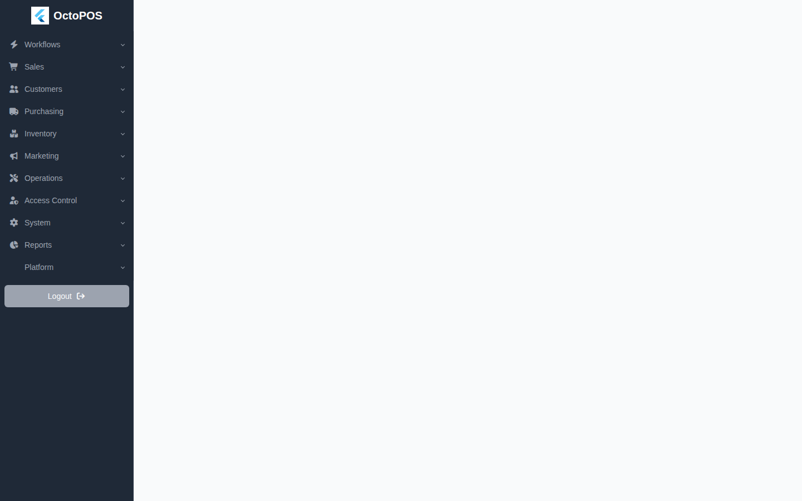
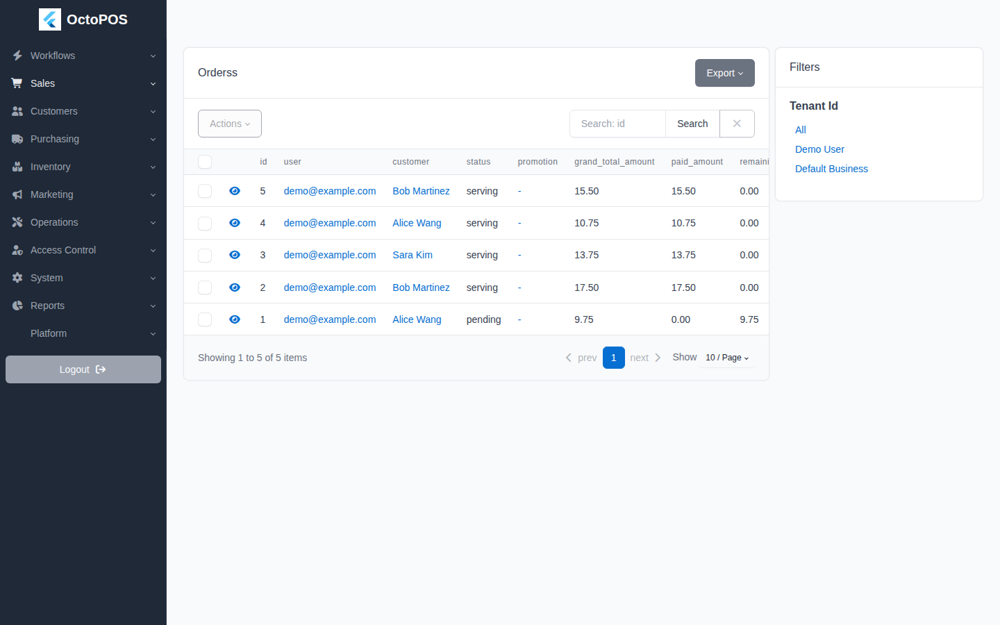
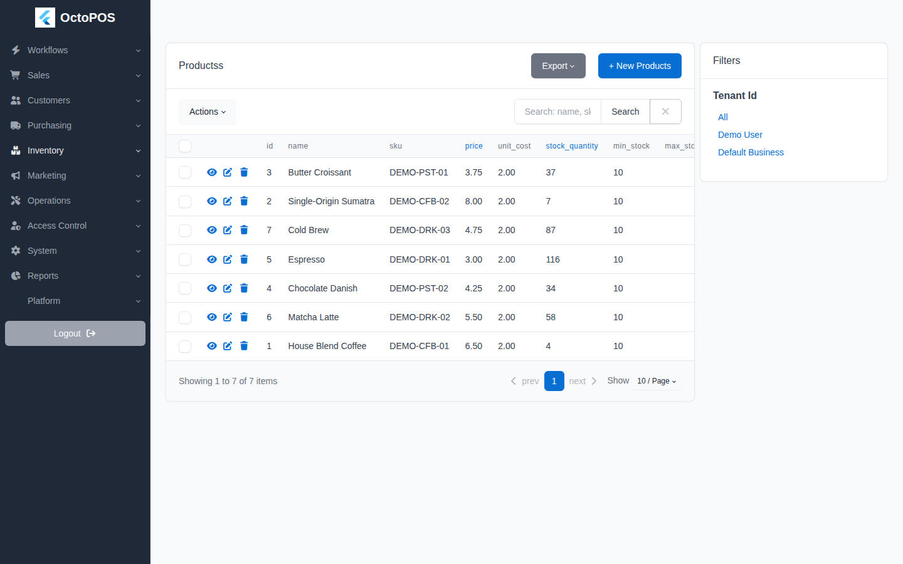
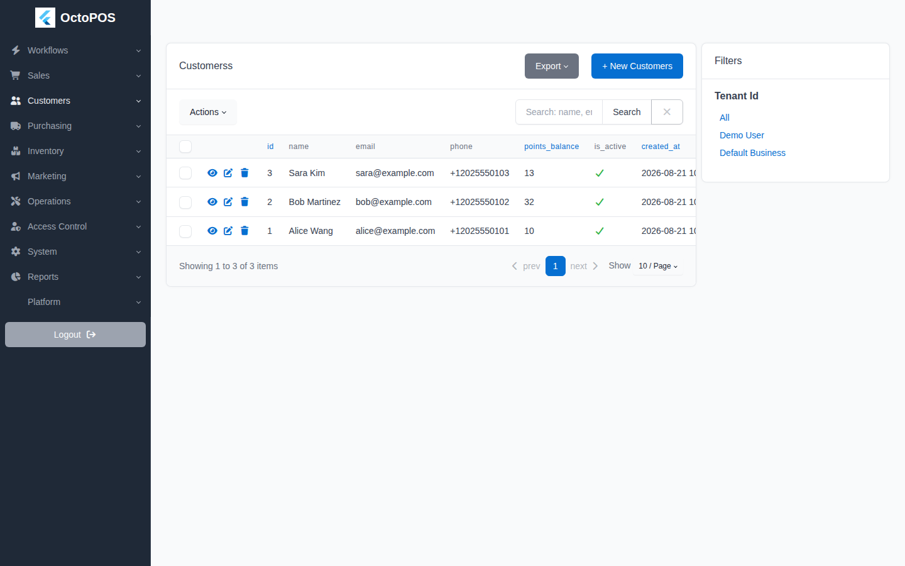
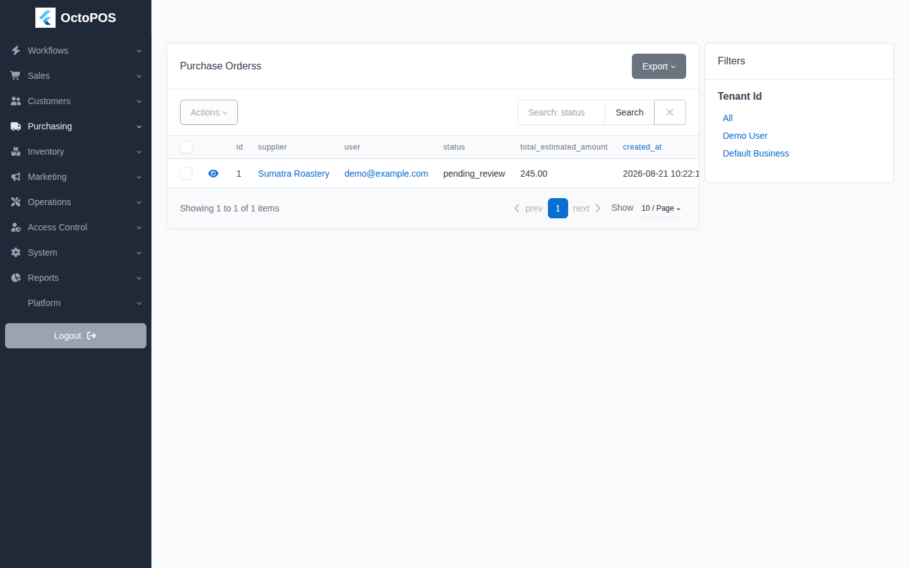
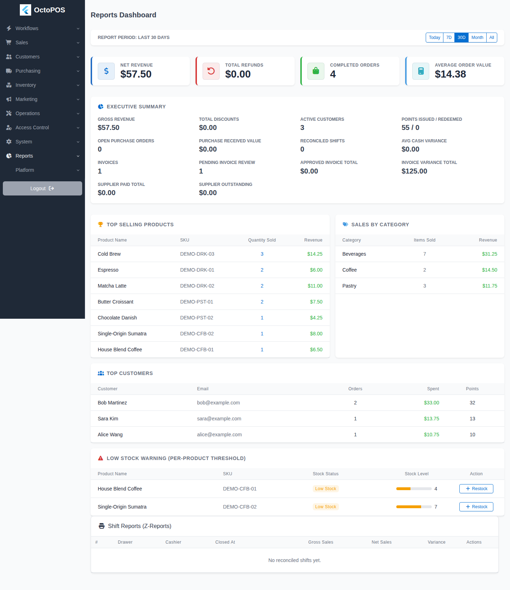
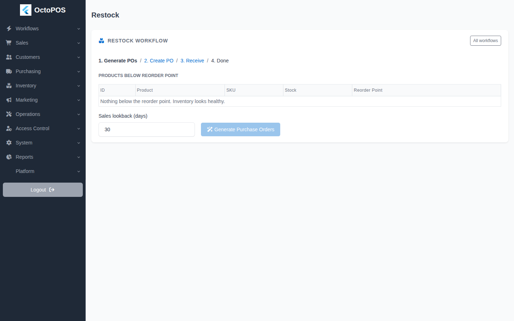
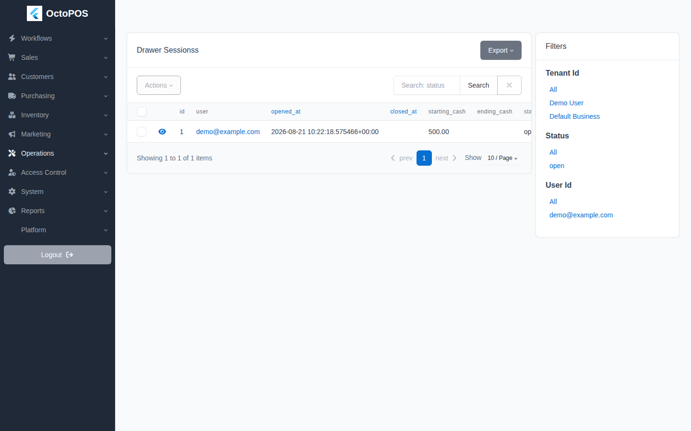

# FastAPI OctoPOS

[](https://opensource.org/licenses/MIT)
[](https://github.com/maulanasly/fastapi-octopos/actions/workflows/ci.yml)

A FastAPI-based Point of Sale (POS) backend with JWT auth, product/inventory management, order/payment flow, order tracking with live maps, pgvector semantic search, drawer sessions, reports, and SQLAdmin dashboard.

> **Note:** Copy `.env.example` to `.env` and update the values before running in production.

## Screenshots

The SQLAdmin panel (`/admin`) covers the main workflows. See
[docs/features.md](docs/features.md) for the full feature inventory.

| Dashboard | Orders |
|---|---|
|  |  |

| Products | Customers |
|---|---|
|  |  |

| Purchase orders | Reports |
|---|---|
|  |  |

| Restock workflow | Drawer sessions |
|---|---|
|  |  |

Screenshots are captured with Playwright (`make screenshots`) against a
seeded dev stack; see [docs/development.md](docs/development.md).

## Table of Contents

- [Features](docs/features.md)
- [Tech Stack](docs/tech-stack.md)
- [Getting Started](docs/getting-started.md)
- [Make Commands](docs/make-commands.md)
- [Environment Variables](docs/environment-variables.md)
- [API Overview](docs/api-overview.md)
- [API Examples](docs/api-examples.md)
- [Admin Panel](docs/admin-panel.md)
- [Database & Migrations](docs/database-migrations.md)
- [Development](docs/development.md)
- [Deployment](docs/deployment.md)

## Quick Start

```bash
git clone https://github.com/maulanasly/fastapi-octopos.git
cd fastapi-octopos
python -m venv .venv
source .venv/bin/activate  # On Windows: .venv\Scripts\activate
make install
cp .env.example .env
make migrate
make run
```

Open:

- Swagger UI: `http://127.0.0.1:8000/docs`
- Admin: `http://127.0.0.1:8000/admin`

See [Getting Started](docs/getting-started.md) for the full guide.

## Environment Variables

Configuration is loaded from `.env` (see `app/core/config.py`). Copy `.env.example` to `.env` and update the values before running:

```bash
cp .env.example .env
```

| Variable | Description | Default |
|----------|-------------|---------|
| `PROJECT_NAME` | Application name | `FastAPI POS Backend` |
| `API_V1_STR` | API prefix | `/api/v1` |
| `ENVIRONMENT` | `development` or `production` — production refuses default secrets | `development` |
| `BACKEND_CORS_ORIGINS` | CORS allowed origins (JSON array) | `["http://localhost:3001", "http://localhost:8080"]` |
| `BACKEND_CORS_ORIGIN_REGEX` | Optional regex allowing additional origins (e.g. ephemeral dev-client ports) | empty |
| `SQLALCHEMY_DATABASE_URI` | Database connection string | SQLite file (`sql_app.db`) |
| `SECRET_KEY` | JWT signing secret (change in production) | Hardcoded tutorial key (insecure; production refuses it) |
| `ALGORITHM` | JWT algorithm | `HS256` |
| `ACCESS_TOKEN_EXPIRE_MINUTES` | Access token lifetime in minutes | `11520` (8 days) |
| `GOOGLE_CLIENT_ID` | Google OAuth client ID (optional) | `None` |
| `ADMIN_USERNAME` | Admin panel username | `admin` |
| `ADMIN_PASSWORD` | Admin panel password | `admin` (change in production) |
| `ADMIN_SESSION_HOURS` | Admin panel session lifetime | `12` |
| `ORDER_RESERVATION_TIMEOUT_MINUTES` | Stock reservation expiry | `15` |
| `RESERVATION_AUTO_EXPIRE_ENABLED` | Periodic + startup sweep of expired reservations (required in production when reservations are on) | `False` |
| `RESERVATION_AUTO_EXPIRE_INTERVAL_SECONDS` | Sweep interval | `300` |
| `DEFAULT_TAX_RATE` | Rate for the migration-seeded default tax rule | `0.0` |
| `DEFAULT_TAX_NAME` | Name for the migration-seeded default tax rule | `VAT` |
| `LOGIN_MAX_ATTEMPTS` | Failed logins before temporary lockout | `5` |
| `LOGIN_LOCKOUT_MINUTES` | Lockout duration after repeated failures | `15` |
| `MEDIA_DIR` | Directory for uploaded product images | `media` |
| `REPLENISHMENT_AUTO_PO_ENABLED` | Scheduled auto-generation of draft purchase orders from reorder points | `False` |
| `REPLENISHMENT_CHECK_INTERVAL_SECONDS` | Auto-PO check interval | `3600` |
| `REPLENISHMENT_LOOKBACK_DAYS` | Sales lookback for replenishment velocity | `30` |
| `RATE_LIMIT_STORAGE_URI` | Rate-limit storage for slowapi; empty = in-memory (single process). Set e.g. `redis://localhost:6380` for multi-worker deployments | empty |
| `EMBEDDING_PROVIDER` | Semantic-search embeddings: `hash` (offline default), `api` (OpenAI-compatible), or `none` | `hash` |
| `EMBEDDING_MODEL` | Model name sent to the embedding API | `all-minilm` |
| `EMBEDDING_DIM` | Embedding dimension — must stay `384` (matches the `products.embedding` vector column) | `384` |
| `EMBEDDING_BASE_URL` | Embedding API base URL (OpenAI-compatible `/embeddings`) | empty |
| `EMBEDDING_API_KEY` | Embedding API key | empty |

## License

MIT License. See [LICENSE](./LICENSE).
